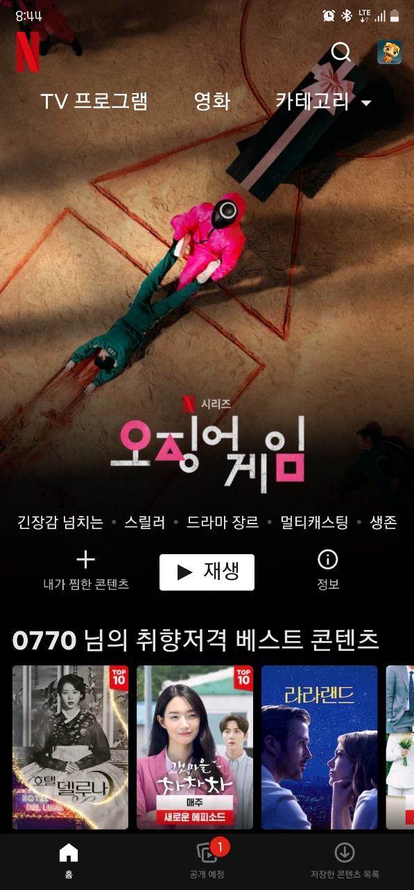
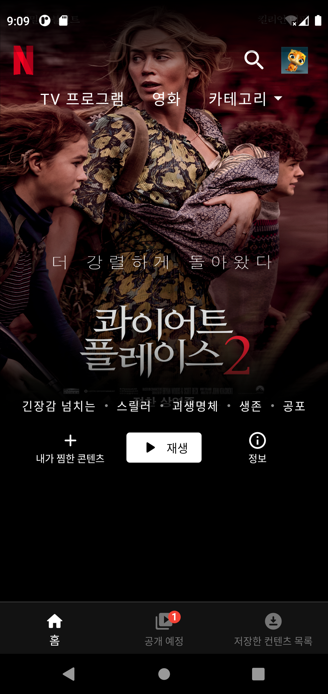

# flutter_netflix_clone

플러터 공부를 시작하며, 넷플릭스 안드로이드 앱 첫 화면 UI를 따라그려보았습니다.

| 기존 앱 화면 (android)                                       | flutter clone                                                |
| ------------------------------------------------------------ | ------------------------------------------------------------ |
|  |  |

